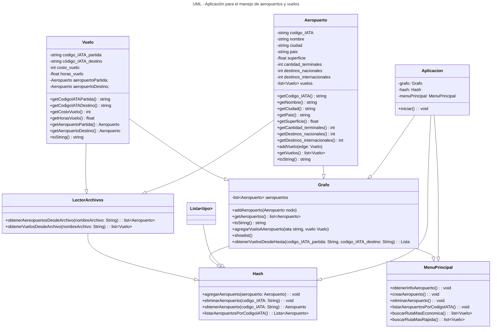

# Algoritmos

## Trabajo Práctico

El trabajo práctico consiste en realizar una aplicación para el manejo de aeropuertos y
vuelos.

### Aeropuertos

La información de los aeropuertos estará dada en un archivo de texto `aeropuertos.txt` que
deberá leerse al iniciar la aplicación.

En cada línea del archivo estará la información de un aeropuerto, separada por espacios:

```
codigo_IATA nombre ciudad pais superficie #cantidad_terminales #destinos_nacionales #destinos_internacionales
```

El código IATA es un código de tres letras que identifica a cada aeropuerto. Por ejemplo, EZE es el aeropuerto Ministro
Pistarini de Ezeiza, COR es el aeropuerto Pajas Blancas de Córdoba. La superficie es un número flotante que indica los
km2. Los últimos tres datos son números enteros con las cantidades correspondientes.

#### Ejemplo:

```
EZE Ministro-Pistarini Ezeiza Argentina 34.75 4 12 46
LAX Aeropuerto-Internacional-de-los-Angeles Los-Angeles EEUU 14 9 87 69
...
```

En la primera línea tenemos al aeropuerto Ministro-Pistarini de Ezeiza (EZE), con 34,75 km2 de superficie, 4 terminales,
12 destinos nacionales y 46 internacionales.

Se debe mostrar un menú en el cual se pueda:

- consultar por un aeropuerto en particular
- dar de alta un nuevo aeropuerto
- dar de baja a alguno
- mostrar todos los aeropuertos (ordenados por código IATA)

Consideraciones

- El archivo está bien formado.
- La implementación puede ser recursiva o iterativa.
- La implementación debe utilizar una tabla de hashing.
- La función de hashing a utilizar debe lograr una buena dispersion.

### Vuelos

A partir de la lectura de un archivo de texto `vuelos.txt`, que deberá hacerse inmediatamente después de leer el
archivo `aeropuertos.txt`,se generará un grafo pesado dirigido.

En cada línea estará la información de cada vuelo, separada por espacios:

```
codigo_IATA_partida código_IATA_destino costo_vuelo horas_vuelo
```

El costo del vuelo es un entero que representa el costo en pesos y las horas de vuelo será un flotante.

#### Ejemplo:

```
EZE MIA 122483 9.2
EZE FCO 222205 13
FCO TXL 4736 2.25
...
```

La primera línea indica que hay un vuelo directo de Ezeiza a Miami que dura 9,2hs, cuyo precio es $122.483. La segunda,
de Ezeiza a Fiumicino, Roma, dura 13 horas y sale $222.205. La tercera, de Fiumicino a Otto-Lilielenthal, Berlín, dura 2
horas y cuarto y su precio es de $4.736.

La aplicación debe pedir al usuario el ingreso de los códigos IATA de partida y de destino, y debe buscar la combinación
de vuelos más económica o de menor tiempo. El usuario debe poder elegir si el camino mínimo está representado por el
costo del vuelo o por la duración.

Se debe imprimir el detalle del vuelo, el costo de cada tramo (o el tiempo de vuelo) y el total del viaje. Si hubiera
más de una combinación óptima, deberá listarlas todas. Puede suceder que no haya ninguna combinación, en ese caso se
informa que no hay conexiones posibles.

Consideraciones

- El archivo está bien formado.
- La implementación puede ser recursiva o iterativa.

A tener en cuenta

- Diseño UML
- Buenas prácticas de programación
- Modularización
- Funcionalidad
- Nombres de métodos y atributos
- Interfaz con el usuario

Nota: la aplicación debe estar completamente orientada a objetos, a excepción del main, en
donde solo puede tener la creación de unos pocos objetos y el llamado a algunos de sus
métodos.

## Entrega

Semanalmente cada equipo deberá realizar una exposición del avance del proyecto.
La entrega final del trabajo será en horario de clases, momento en el que se hará la defensa del mismo. Por defensa se
entiende la muestra del trabajo junto con una explicación por parte de cada uno de los integrantes.

## Diseño UML


